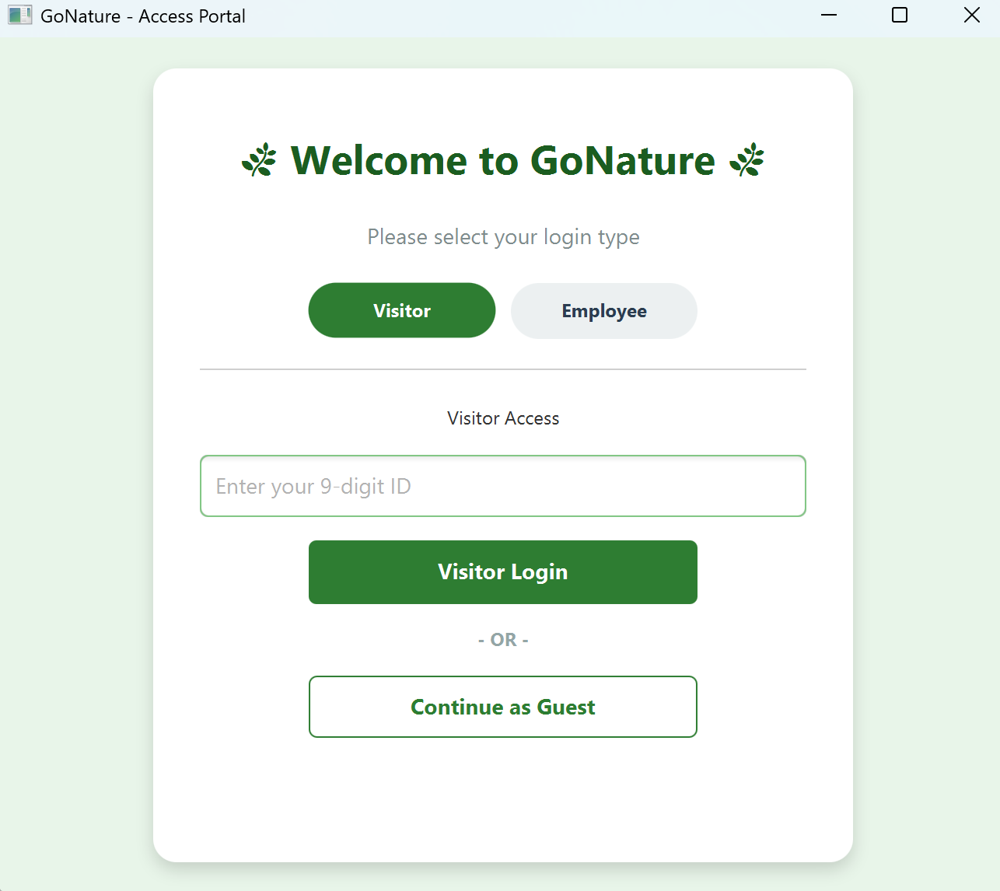
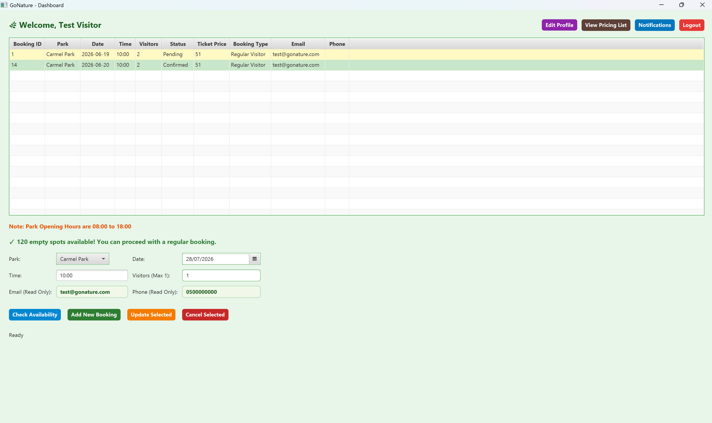
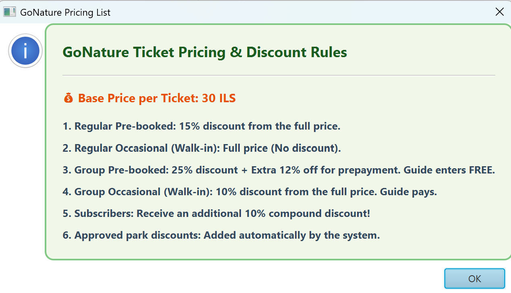
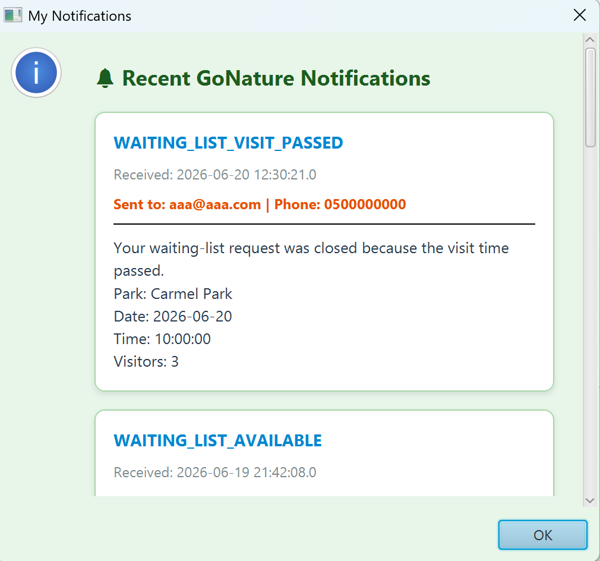
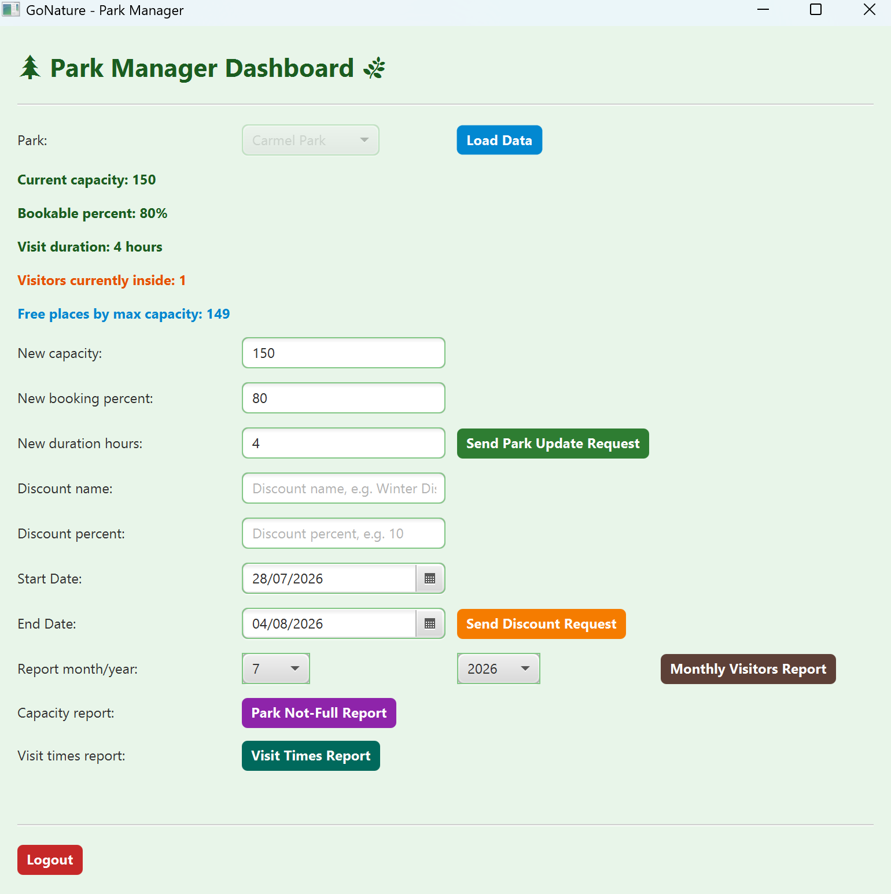
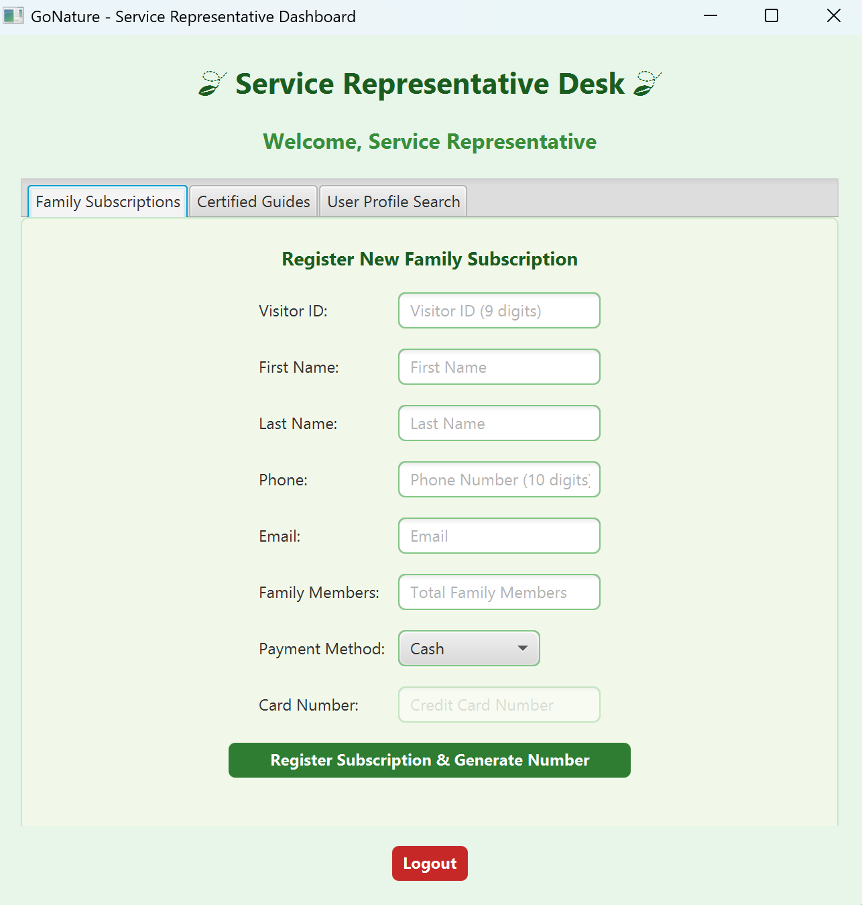
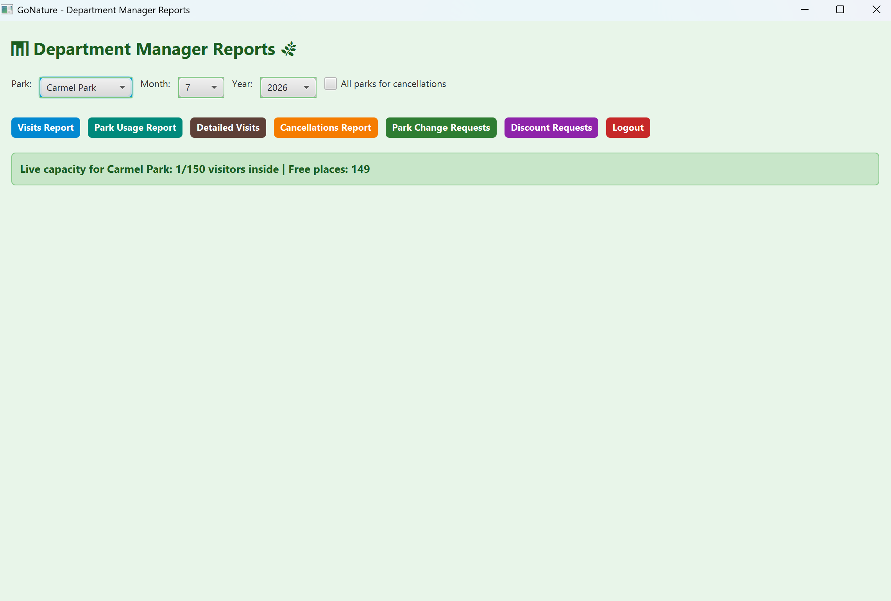
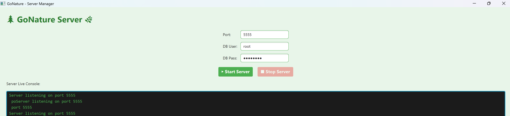

# 🌿 GoNature — National Parks Booking System

GoNature is a client-server desktop application for managing visits to national
parks: online booking, capacity control, waiting lists, subscriptions,
discounts, and management reporting. It was built as a multi-module Java
project with a JavaFX client, a socket-based server, and a MySQL database.

## Table of Contents
- [Overview](#overview)
- [Screenshots](#screenshots)
- [Architecture](#architecture)
- [Tech Stack](#tech-stack)
- [Project Structure](#project-structure)
- [Getting Started](#getting-started)
- [Database Setup](#database-setup)
- [Running the App](#running-the-app)
- [Demo Accounts](#demo-accounts)
- [Roles & Features](#roles--features)

## Overview

GoNature lets visitors book a park visit in advance or walk in on the day,
join a waiting list when a park is full, and manage a family subscription for
recurring discounts. Park staff and managers get dedicated dashboards to run
the park floor, approve capacity/discount change requests, and generate
reports.

The system is split into three independent modules that communicate over a
custom socket protocol built on **OCSF** (Object Client-Server Framework):

- **GoNatureClient** – JavaFX desktop app used by visitors and employees.
- **GoNatureServer** – JavaFX-managed server with a MySQL-backed data layer.
- **GoNatureCommon** – shared model classes (`Booking`, `Visitor`, `Parks`,
  `Message`) used by both client and server.

## Screenshots

<table>
<tr>
<td width="50%">

**Access Portal — login for visitors & employees**


</td>
<td width="50%">

**Visitor Dashboard — bookings & availability**


</td>
</tr>
<tr>
<td width="50%">

**Pricing List — discount rules reference**


</td>
<td width="50%">

**Notifications — booking & waiting-list updates**


</td>
</tr>
<tr>
<td width="50%">

**Park Manager Dashboard — capacity & discount requests**


</td>
<td width="50%">

**Service Representative Desk — subscriptions & guides**


</td>
</tr>
<tr>
<td width="50%">

**Department Manager Reports — visits, cancellations, requests**


</td>
<td width="50%">

**Server Manager — start/stop the server, live console**


</td>
</tr>
</table>

## Architecture

```
┌──────────────────┐        OCSF / TCP sockets        ┌──────────────────┐
│  GoNatureClient  │ ───────────────────────────────▶ │  GoNatureServer  │
│   (JavaFX GUI)   │ ◀─────────────────────────────── │   (JavaFX GUI)   │
└──────────────────┘          Message objects          └────────┬─────────┘
        ▲                                                       │ JDBC
        │        shared model classes                           ▼
        └───────────────  GoNatureCommon  ─────────────▶  MySQL Database
```

- The client never talks to the database directly — every action is sent as
  a `Message` over the socket connection and handled by a DAO on the server.
- DAOs (`BookingDAO`, `VisitorDAO`, `EmployeeDAO`, `ParkDAO`, `WaitingListDAO`,
  `NotificationDAO`, `DiscountDAO`, `ReportDAO`) encapsulate all SQL.

## Tech Stack

- **Language:** Java 21
- **UI:** JavaFX 21
- **Networking:** OCSF (Object Client-Server Framework)
- **Database:** MySQL 8.0+ (JDBC via `mysql-connector-j`)
- **Build/IDE:** Eclipse project files included (`.project` / `.classpath`)

## Project Structure

```
GoNature/
├── GoNatureClient/     # JavaFX client app (visitor & employee UI)
│   └── src/client/...
├── GoNatureServer/     # Server app + DAOs + JavaFX admin console
│   └── src/server/...
├── GoNatureCommon/     # Shared model classes used by client & server
│   └── src/common/...
├── schema.sql          # Database schema (tables, constraints, indexes)
└── sample_data.sql     # Fictional demo data for local testing
```

> The client and server each depend on `GoNatureCommon` as a linked source
> project, so all three folders should sit as sibling projects if you're
> importing them into Eclipse.

## Getting Started

### Prerequisites

- JDK 21
- [JavaFX SDK 21](https://gluonhq.com/products/javafx/) (not bundled with the
  JDK — download separately and point your IDE's classpath at its `lib`
  folder)
- MySQL Server 8.0+
- `mysql-connector-j` JAR on the server (and client, if it connects directly
  during development)
- Eclipse (recommended, since the repo ships Eclipse project metadata) or any
  IDE that can import Java projects with linked source folders

### Clone

```bash
git clone https://github.com/<your-username>/GoNature.git
cd GoNature
```

## Database Setup

1. Create the schema:
   ```bash
   mysql -u root -p < schema.sql
   ```
2. (Optional) Load fictional demo data — parks, visitors, employees, bookings,
   a subscription, a waiting-list entry, notifications, and pending manager
   requests:
   ```bash
   mysql -u root -p < sample_data.sql
   ```

`sample_data.sql` is entirely fictional and safe to publish — it exists only
so reviewers/graders can see the app working without creating data by hand.

## Running the App

1. **Import** `GoNatureCommon`, `GoNatureServer`, and `GoNatureClient` into
   Eclipse as three separate projects (or set up equivalent modules in your
   IDE of choice), and attach the JavaFX SDK + MySQL connector JARs.
2. **Start the server:** run `server.main.ServerMain`. This opens the *GoNature
   Server* window — enter the port and MySQL credentials, then click **Start
   Server**.
3. **Start the client:** run `client.ClientMain`. This opens the *GoNature
   Access Portal* — connect to the server and log in as a visitor or
   employee.
4. You can run multiple client instances to simulate several visitors/staff
   connected at once.

## Demo Accounts

These come from `sample_data.sql`:

| Role | ID / Username | Password |
|---|---|---|
| Visitor | `900000001` / `demoVisitor` | `demo1234` |
| Guide | `900000002` / `demoGuide` | `demo1234` |
| Subscriber | `900000003` / `demoSubscriber` | `demo1234` |
| Service Representative | `800000001` | `demo1234` |
| Carmel Park — Entrance Worker | `800000002` | `demo1234` |
| Carmel Park — Manager | `800000003` | `demo1234` |
| Department Manager | `800000004` | `demo1234` |
| Banias Park — Manager | `800000005` | `demo1234` |
| Banias Park — Entrance Worker | `800000006` | `demo1234` |

You can also enter the portal as a **Guest** (`CASUAL`) for a walk-in visit
with no account.

## Roles & Features

- **Visitor:** book a visit, check live availability, join a waiting list,
  view notifications, edit profile, view the pricing list.
- **Guide:** book/lead group visits.
- **Subscriber:** family subscription with an extra compound discount.
- **Entrance Worker:** check visitors in/out, register walk-ins.
- **Service Representative:** register family subscriptions, manage certified
  guides, search visitor profiles.
- **Park Manager:** view live capacity, request capacity/booking-percent/
  duration changes, request discounts, run park-level reports.
- **Department Manager:** approve/reject park-change and discount requests,
  and run cross-park reports (visits, park usage, detailed visits,
  cancellations).

---

All names, emails, phone numbers, and payment details in this repository are
fictional and provided only for demonstration purposes.
